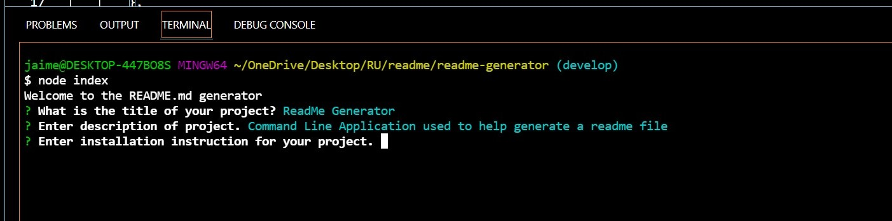
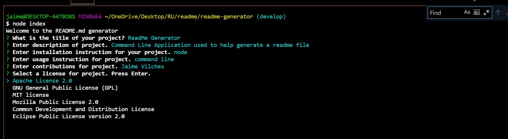

# README GENERATOR:

1. [ Description. ](#desc)
2. [ Web Address. ](#web-address)
3. [ Usage tips. ](#usage)
4. [ Questions. ](#questions)

## 1. DESCRIPTION

This application is a READEME Generator wich helps the user create an organized README file. 
This is a command line application that runs on Node.js and uses Javascript, Inquirer and fs.

## 2. How to Get There

Open your favorite web browser and enter the following web address to access.

git@github.com:JaimeVilches87/readme-generator.git

## 3. Usage Tips

Start by running node on command line

Answer questions to input name, description, installations, etc...

Choose license from choices provided

Testing the application  

## 4. Questions

Any questions feel free to reach out to me!

Email: JaimeVilches87@gmail.com